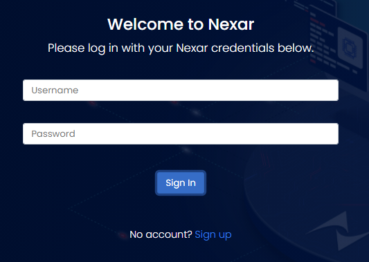
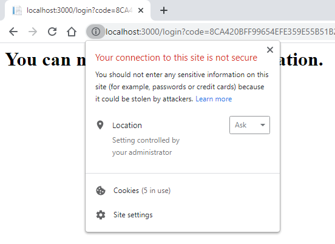

# nexar-token

Getting Nexar tokens, the tool and sample.

## Usage

Change to the project source directory

    cd src

and invoke as

    dotnet run <clientId> <clientSecret> [<domain>]

### Supply token

To get a supply token, invoke

    dotnet run <clientId> <clientSecret> supply

This token does not require signing with Altium Live credentials.
It is suitable for the Supply operations, i.e. queries with the prefix `sup`.

### Design token

To get a design token, invoke

    dotnet run <clientId> <clientSecret>

On the first run it starts the browser with the Nexar identity login page:

Enter your credentials and click `Sing In`.
The Nexar token is printed to the console.

On next runs your browser may remember credentials and skip the login page.
You may clean the cookies in order to ensure the login page. E.g. in Chrome,
click the `(i)` icon in the address bar, then `Cookies` and remove cookies:

## Notes

### nexar-token executable

Instead of `dotnet run` which builds and runs the tool you may use the already built `nexar-token` directly

    <path>/nexar-token [arguments]

### Output to clipboard

In PowerShell

    dotnet run | Set-Clipboard
    nexar-token | Set-Clipboard

In cmd

    dotnet run | clip
    nexar-token | clip
